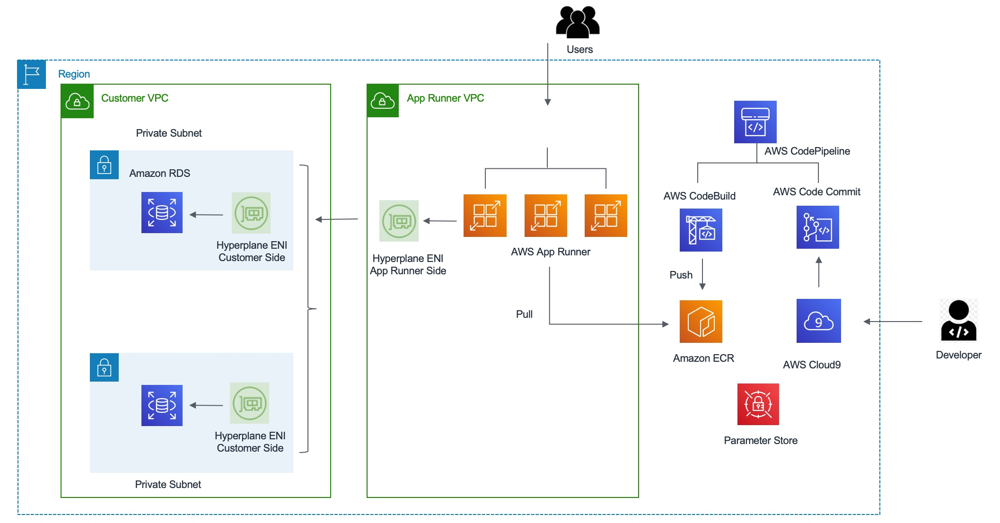
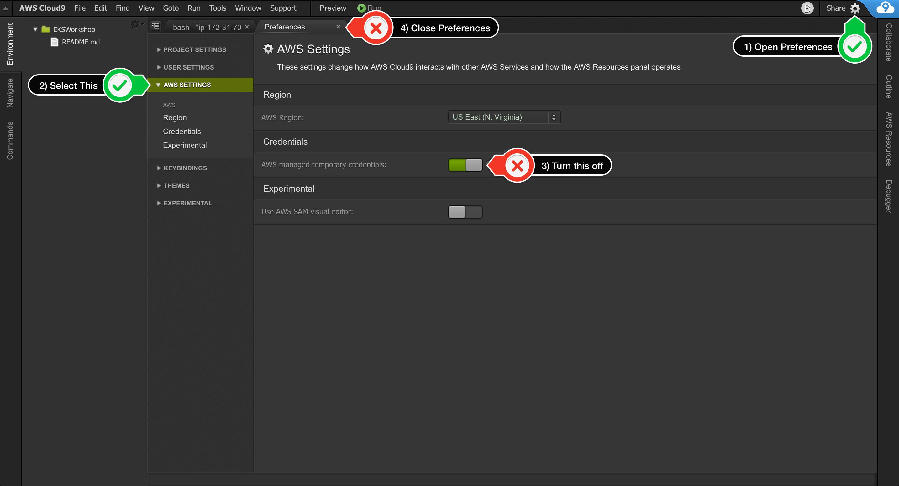

# Build and deploy solutions on AWS using AWS App Runner and Amazon RDS 


[](https://gitpod.io/#https://github.com/aws/aws-cdk)
[](https://badge.fury.io/js/aws-cdk)
[](https://badge.fury.io/py/aws-cdk.core)
[](https://badge.fury.io/nu/Amazon.CDK)

## Background

AWS launched [AWS App Runner](https://aws.amazon.com/apprunner/) service in 2021 that leverages AWS best practices and technologies for deploying and running containerized web applications and APIs at scale. This leads to a drastic reduction in your time to market for new applications and features. App Runner runs on top of AWS ECS and Fargate. 

On Feb 9, 2022 AWS launched [AWS announced VPC support for App Runner services](https://aws.amazon.com/about-aws/whats-new/2022/02/aws-app-runner-amazon-vpc/). With this feature, App Runner applications can now connect to private endpoints in your VPC, and you can enable a more secure and compliant environment by removing public access to these resources.

AWS App Runner services can now communicate with other applications hosted in an Amazon Virtual Private Cloud (Amazon VPC). You can now connect you App Runner services to databases in Amazon Relational Database Service (Amazon RDS), to Redis caches in Amazon ElastiCache, or to message queues in Amazon MQ. You can also connect your services to your own applications in Amazon Elastic Container Service (Amazon ECS), Amazon Elastic Kubernetes Service (Amazon EKS), or Amazon Elastic Compute Cloud (Amazon EC2). As a result, web applications and APIs running on App Runner can now get powerful support from data services on AWS to build production architectures.

To enable VPC access for your App Runner service, simply pass the subnets of the VPC and security groups while you create or update your App Runner service. App Runner uses this information to create network interfaces that facilitate communication to a VPC. If you pass multiple subnets, App Runner creates multiple network interfaces—one for each subnet. To learn more about VPC support for AWS App Runner, check out the the blog post written by Archana Srikanta [Deep Dive on AWS App Runner VPC Networking](https://aws.amazon.com/blogs/containers/deep-dive-on-aws-app-runner-vpc-networking/).

## Introduction

This workshop is designed to enable AWS partners and their customers to build and deploy solutions on AWS using AWS App Runner and Amazon RDS. The workshop consists of a number of sections to create solutions using Continuous Integration and Continuous Delivery patterns. You will be using AWS services like AWS App Runner, Amazon RDS, AWS CodePipeline, AWS CodeCommit and AWS CodeBuild. 

## Solution Architecture 

We shall build a solution using the [Spring Framework](https://spring.io/projects/spring-framework). This sample solution is designed to show how the Spring application framework can be used to build a simple, but powerful database-backed applications. It uses AWS RDS (MySQL) at the backend and it will demonstrate the use of Spring's core functionality. This architecture enable AWS partners and their customers to build and deploy containerized solutions on AWS using AWS App Runner,  AWS RDS and Spring framework. The Spring Framework is a collection of small, well-focused, loosely coupled Java frameworks that can be used independently or collectively to build industrial strength applications of many different types. 


Here are the key Terraform resources in the solution architecture.
#### Security group
```bash
resource "aws_security_group" "db-sg" {
  name        = "${var.stack}-db-sg"
  description = "Access to the RDS instances from the VPC"
  vpc_id      = aws_vpc.main.id

  ingress {
    from_port   = 3306
    to_port     = 3306
    protocol    = "tcp"
    cidr_blocks = ["0.0.0.0/0"]
  }

  egress {
    from_port   = 0
    to_port     = 0
    protocol    = "-1"
    cidr_blocks = ["0.0.0.0/0"]
  }

  tags = {
    Name = "${var.stack}-db-sg"
  }
}
```
#### VPC connector
```bash
resource "aws_apprunner_vpc_connector" "connector" {
  vpc_connector_name = "petclinic_vpc_connector"
  subnets            = aws_subnet.private[*].id
  security_groups    = [aws_security_group.db-sg.id]
}
```
#### App Runner service
```bash
resource "aws_apprunner_service" "service" {
  auto_scaling_configuration_arn = aws_apprunner_auto_scaling_configuration_version.auto-scaling-config.arn
  service_name                   = "apprunner-petclinic"
  source_configuration {
    authentication_configuration {
      access_role_arn = aws_iam_role.apprunner-service-role.arn
    }
  }
  
  network_configuration {
    egress_configuration {
      egress_type       = "VPC"
      vpc_connector_arn = aws_apprunner_vpc_connector.connector.arn
    }
  }
```
## Prerequisites

Before you build the whole infrastructure, including your CI/CD pipeline, you will need to meet the following pre-requisites.

### AWS account

Ensure you have access to an AWS account, and a set of credentials with *Administrator* permissions. **Note:** In a production environment we would recommend locking permissions down to the bare minimum needed to operate the pipeline.

### Create an AWS Cloud9 environment

You can create a bootstrapped Cloud9 environment by deploying the [cloudformation/cloud9.yaml](cloudformation/cloud9.yaml) via the [CloudFormation console](https://us-east-1.console.aws.amazon.com/cloudformation/home?region=us-east-1#/stacks/create/template). This will set up a new Cloud9 instance for you to use for the workshop. Note that it may take several minutes after the Cloud9 instance is available before it is completely configured.

### Configure the AWS Cloud9 environment

Launch the AWS Cloud9 IDE. Close the `Welcome` tab and open a new `Terminal` tab.


#### Create and attach an IAM role for your Cloud9 instance

By default, Cloud9 manages temporary IAM credentials for you.  Unfortunately these are incomaptible with Terraform. To get around this you need to disable Cloud9 temporary credentials, and create and attach an IAM role for your Cloud9 instance.

1. Open your [Cloud9 IDE](https://us-east-1.console.aws.amazon.com/cloud9/home?region=us-east-1#) and click the gear icon (in top right corner), or click to open a new tab and choose "Open Preferences"
1. Select **AWS SETTINGS**
1. Turn off **AWS managed temporary credentials**
1. Close the Preferences tab

1. In the Cloud9 terminal pane, execute the command:
    ```bash
    rm -vf ${HOME}/.aws/credentials
    ```
1. As a final check, use the [GetCallerIdentity](https://docs.aws.amazon.com/cli/latest/reference/sts/get-caller-identity.html) CLI command to validate that the Cloud9 IDE is using the correct IAM role.
    ```bash
    aws sts get-caller-identity --query Arn | grep AppRunnerC9Role -q && echo "IAM role valid" || echo "IAM role NOT valid"
    ```

#### Configure awscli

Run `aws configure` to configure your region. Leave all the other fields blank. You should have something like:

```
admin:~/environment $ aws configure
AWS Access Key ID [None]: 
AWS Secret Access Key [None]: 
Default region name [None]: us-east-1
Default output format [None]: 
```
#### Verify maven is installed

Verify the Apache Maven installation:

```bash
source ~/.bashrc
mvn --version
```

## Package the application using Apache Maven

```bash
cd ~/environment/aws-solutions-apprunner-vpc-terraform/petclinic
mvn package -Dmaven.test.skip=true
```
The first time you execute this (or any other) command, Maven will need to download the plugins and related dependencies it needs to fulfill the command. From a clean installation of Maven, this can take some time (note: in the output above, it took almost five minutes). If you execute the command again, Maven will now have what it needs, so it won’t need to download anything new and will be able to execute the command quicker.

The compiled java classes were placed in spring-petclinic/target/classes, which is another standard convention employed by Maven. By using the standard conventions, the POM above is small and you haven’t had to tell Maven explicitly where any of your sources are or where the output should go. By following the standard Maven conventions, you can do a lot with little effort.

## Build and tag the Petclinic docker image
From the petclinic directory:

```bash
docker build -t petclinic .
```

## Run Petclinic application locally
Run the following inside the Cloud9 terminal:

```bash
docker run -it --rm -p 8080:80  --name petclinic petclinic
```


This will run the application using container port of 80 and will expose the application to host port of 8080. Click Preview from the top menu and then click “Preview Running Application.” It will open a browser displaying the Spring Petclinic application.


## Build the infrastructure and pipeline

We shall use Terraform to build the above architecture including the AWS CodePipeline.

**Note:** This workshop will create chargeable resources in your account. When finished, please make sure you clean up resources as instructed at the end.

### Set up SSM parameter for DB passwd

```bash
aws ssm put-parameter --name /database/password  --value mysqlpassword --type SecureString
```

### Edit terraform variables

```bash
cd ~/environment/aws-solutions-apprunner-vpc-terraform/terraform
```

Edit `.auto.tfvars`, leave the `aws_profile` as `"default"`, and ensure `aws_region` matches your environment, and that `codebuild_cache_bucket_name` has a value similar to `apprunner-cache-<your_account_id>`. 

If not replace the placeholder `yyyymmdd-identifier`  with today's date and something unique to you to create globally unique S3 bucket name. S3 bucket names can include numbers, lowercase letters and hyphens.

If you don't see the `.auto.tfvars` file you may have to select 'Show Hidden Files' option under the gear on the left hand side of the IDE.


### Build

Initialise Terraform:

```bash
terraform init
```

Build the infrastructure and pipeline using terraform:

```bash
terraform apply
```

Terraform will display an action plan. When asked whether you want to proceed with the actions, enter `yes`.

Wait for Terraform to complete the build before proceeding. It will take few minutes to complete “terraform apply” 

### Explore the stack you have built

Once the build is complete, you can explore your environment using the AWS console:
- View the App Runner service using the [AWS App Runner console](https://console.aws.amazon.com/apprunner/)
- View the RDS database using the [Amazon RDS console](https://console.aws.amazon.com/rds).
- View the ECR repo using the [Amazon ECR console](https://console.aws.amazon.com/ecr).
- View the CodeCommit repo using the [AWS CodeCommit console](https://console.aws.amazon.com/codecommit).
- View the CodeBuild project using the [AWS CodeBuild console](https://console.aws.amazon.com/codebuild).
- View the pipeline using the [AWS CodePipeline console](https://console.aws.amazon.com/codepipeline).


Note that your pipeline starts in a failed state. That is because there is no code to build in the CodeCommit repo! In the next step you will push the petclinic app into the repo to trigger the pipeline.

### Explore the App Runner service
Open the App Runner service configuration file [terraform/services.tf](terraform/services.tf) file and explore the options specified in the file.

```typescript
 image_repository {
      image_configuration {
        port = var.container_port
        runtime_environment_variables = {
            "AWS_REGION" : "${var.aws_region}",
            "SPRING_DATASOURCE_USERNAME" : "${var.db_user}",
            "SPRING_DATASOURCE_INITIALIZATION_MODE" : var.db_initialize_mode,
            "SPRING_PROFILES_ACTIVE" : var.db_profile,
            "SPRING_DATASOURCE_URL" : "jdbc:mysql://${aws_db_instance.db.address}/${var.db_name}"
         }
      }
      image_identifier      = "${data.aws_ecr_repository.image_repo.repository_url}:latest"
      image_repository_type = "ECR"
    }
```
**Note:** In a production environment it is a best practice to use a meaningful tag instead of using the `:latest` tag.

## Deploy petclinic application using the pipeline

You will now use git to push the petclinic application through the pipeline.


### Set up a local git repo for the petclinic application

Start by switching to the `petclinic` directory:

```bash
cd ~/environment/aws-solutions-apprunner-vpc-terraform/petclinic
```

Set up your git username and email address:

```bash
git config --global user.name "Your Name"
git config --global user.email you@example.com
```

Now ceate a local git repo for petclinic as follows:

```bash
git init
git add .
git commit -m "Baseline commit"
```

### Set up the remote CodeCommit repo

An AWS CodeCommit repo was built as part of the pipeline you created. You will now set this up as a remote repo for your local petclinic repo.

For authentication purposes, you can use the AWS IAM git credential helper to generate git credentials based on your IAM role permissions. Run:

```bash
git config --global credential.helper '!aws codecommit credential-helper $@'
git config --global credential.UseHttpPath true
```

From the output of the Terraform build, we use the output `source_repo_clone_url_http` in our next step.

```bash
cd ~/environment/aws-solutions-apprunner-vpc-terraform/terraform
export tf_source_repo_clone_url_http=$(terraform output --raw source_repo_clone_url_http)
```

Set this up as a remote for your git repo as follows:

```bash
cd ~/environment/aws-solutions-apprunner-vpc-terraform/petclinic
git remote add origin $tf_source_repo_clone_url_http
git remote -v
```

You should see something like:

```bash
origin  https://git-codecommit.eu-west-2.amazonaws.com/v1/repos/petclinic (fetch)
origin  https://git-codecommit.eu-west-2.amazonaws.com/v1/repos/petclinic (push)
```


### Trigger the pipeline

To trigger the pipeline, push the master branch to the remote as follows:

```bash
git push -u origin master
```

The pipeline will pull the code, build the docker image, push it to ECR, and deploy it to your ECS cluster. This will take a few minutes.
You can monitor the pipeline in the [AWS CodePipeline console](https://console.aws.amazon.com/codepipeline).


### Test the application

From the output of the Terraform build, note the Terraform output `apprunner_service_url`.

```bash
cd ~/environment/aws-solutions-apprunner-vpc-terraform/terraform
export tf_apprunner_service_url=$(terraform output apprunner_service_url)
echo $tf_apprunner_service_url
```

Use this in your browser to access the application.


## Push a change through the pipeline and re-test

The pipeline can now be used to deploy any changes to the application.

You can try this out by changing the welcome message as follows:

```
cd ~/environment/aws-solutions-apprunner-vpc-terraform/petclinic
vi src/main/resources/messages/messages.properties
```
Change the value for the welcome string, for example, to "Hello".

Commit the change:

```
git add .
git commit -m "Changed welcome string"
```

Push the change to trigger pipeline:

```bash
git push origin master
```

As before, you can use the console to observe the progression of the change through the pipeline. Once done, verify that the application is working with the modified welcome message.


## Tearing down the stack

**Note:** If you are participating in this workshop at an AWS-hosted event using Event Engine and a provided AWS account, you do not need to complete this step. We will cleanup all managed accounts afterwards on your behalf.

Make sure that you remember to tear down the stack when finshed to avoid unnecessary charges. You can free up resources as follows:

```
cd ~/environment/aws-solutions-apprunner-vpc-terraform/terraform
terraform destroy
```

When prompted enter `yes` to allow the stack termination to proceed.

Once complete, note that you will have to manually empty and delete the S3 bucket used by the pipeline.

## Delete the Amazon ECR

```bash
aws ecr delete-repository \
    --repository-name $REPOSITORY_NAME \
	--region $AWS_REGION \
    --force
```
